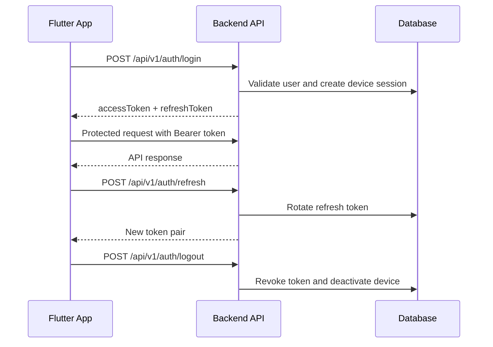

# Authentication Flow

Token lifetime:

| Token | Lifetime | Storage |
| --- | --- | --- |
| Access token | 15 minutes | In memory where possible; secure storage only if needed for app resume. |
| Refresh token | 30 days | Secure storage only. |

Required auth flow:

```text
Login
  -> Access Token (15 min)
  -> Refresh Token (30 days)
  -> Refresh
  -> New Access Token
```

## Login

Endpoint:

```text
POST /api/v1/auth/login
```

Body:

```json
{
  "email": "user@test.com",
  "password": "Password@123",
  "deviceId": "flutter-dev-device-001",
  "deviceName": "Flutter Emulator",
  "platform": "ANDROID",
  "appVersion": "1.0.0",
  "pushToken": "optional-fcm-token"
}
```

The `email` field accepts either email or mobile number.

## Web Portal Login

Endpoint:

```text
POST /api/v1/auth/portal-login
```

Body:

```json
{
  "email": "admin@test.com",
  "password": "Password@123"
}
```

This endpoint is strictly for the admin web portal and does not create a device session or require device fingerprinting. It only returns an `accessToken`.

## Refresh Token

Endpoint:

```text
POST /api/v1/auth/refresh
```

Flutter should refresh shortly before access-token expiry and also retry once after a 401 `INVALID_TOKEN`. If refresh fails, clear local session and route to login.

## Logout

Endpoint:

```text
POST /api/v1/auth/logout
```

Use for current-device logout. Remove FCM token first with `DELETE /api/v1/mobile/notifications/token` when the device has a registered push token.

## Logout All

Endpoint:

```text
POST /api/v1/auth/logout-all
```

Use from security settings when the user wants to terminate all sessions.

## Forgot Password (OTP Flow)

1. **Request OTP**:
   Endpoint: `POST /api/v1/auth/forgot-password`
   Body:
   ```json
   {
     "emailOrPhone": "admin@test.com"
   }
   ```
   The backend will generate a 6-digit numeric OTP, invalidate previous tokens, and simulate an email delivery.

2. **Retrieve OTP (For Testing & Admins)**:
   Endpoint: `GET /api/v1/auth/test-otp?email=admin@test.com`
   Response:
   ```json
   {
     "success": true,
     "message": "Latest OTP",
     "data": "123456"
   }
   ```
   *Note: This endpoint should only be used in non-production environments or by automated E2E tests.*

3. **Reset Password**:
   Endpoint: `POST /api/v1/auth/reset-password`
   Body:
   ```json
   {
     "token": "123456",
     "newPassword": "NewPassword@123"
   }
   ```

## Device Sessions

| Action | API |
| --- | --- |
| List sessions | `GET /api/v1/auth/devices` or `GET /api/v1/mobile/security/devices` |
| Revoke session | `DELETE /api/v1/auth/devices/{id}` or `DELETE /api/v1/mobile/security/devices/{id}` |



Use the Swagger `Authorize` button with `Bearer <accessToken>` or the raw access token value.
